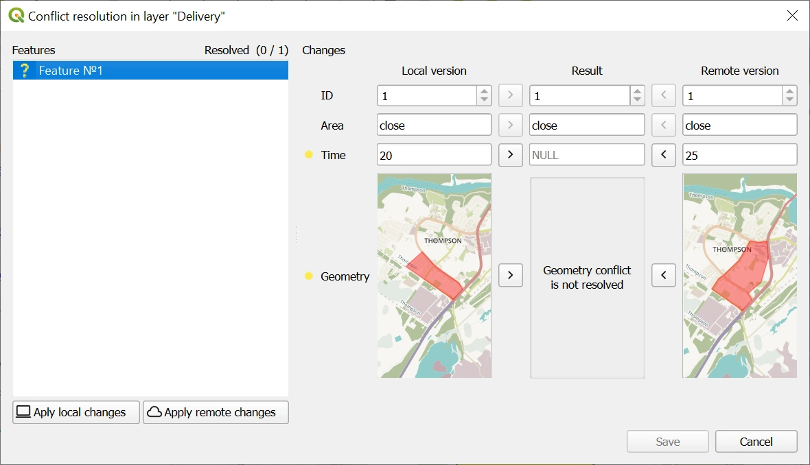
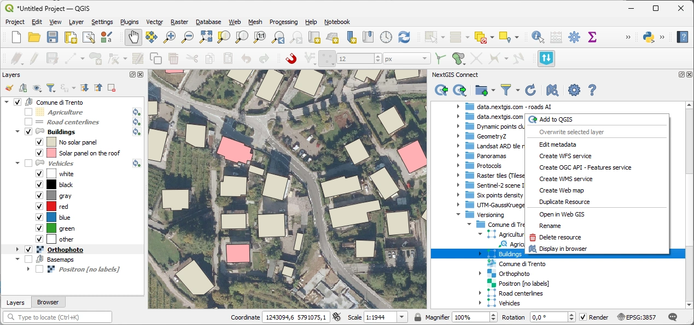
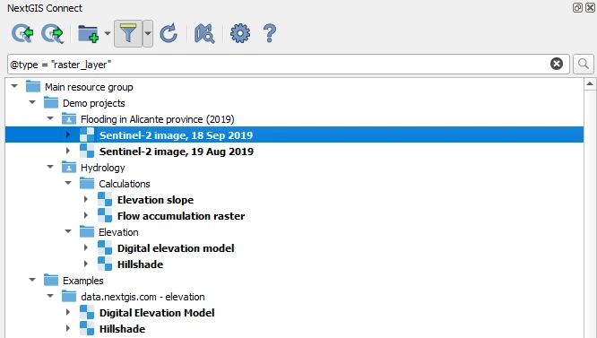

# NextGIS Connect

**NextGIS Connect** is a plugin that transforms **QGIS** into a **collaborative workspace for GIS teams**, enabling seamless publishing, shared editing, and real-time synchronization with NextGIS Web.

It creates a multi-user, server-backed environment where teams work on the same data and maps simultaneously.

---

## Table of contents

- [Key capabilities](#key-capabilities)
  - [Project publishing and deployment](#project-publishing-and-deployment)
  - [Collaborative data editing](#collaborative-data-editing)
  - [Real-time updates and conflict resolution](#real-time-updates-and-conflict-resolution)
  - [Resource and service management](#resource-and-service-management)
  - [Search and navigation](#search-and-navigation)
- [Typical use cases](#typical-use-cases)
- [Installation](#installation)
- [Documentation and learning resources](#documentation-and-learning-resources)
- [Community and ecosystem](#community-and-ecosystem)
- [Commercial support](#commercial-support)
- [License](#license)

---

## Key capabilities

### QGIS project publishing and deployment

- **Instant QGIS project publishing to NextGIS Web**  
  Publish your QGIS project to the Web with a single click. Layer structure, data sources, and cartographic styles are preserved.

- **Connect to NextGIS Web maps, layers, and services**  
  Deploy ready-to-work QGIS projects directly from Web Maps and data sources hosted in NextGIS Web.

---

### Collaborative data editing

- **Direct editing of server-side data**  
  Edit data stored in NextGIS Web directly from QGIS, using the full set of QGIS editing and analysis tools.

- **Shared editing across multiple QGIS instances**  
  Several team members can work on the same layers and maps simultaneously from different QGIS installations.

---

### Real-time updates and conflict resolution

- **Real-time server-side data updates**  
  See edits made by other team members as they happen, keeping your local workspace in sync with the server.

- **Built-in conflict resolution mechanism**  
  When multiple users edit the same object, conflicts can be resolved interactively, preventing accidental data loss.

---

### Resource and service management

- **Manage NextGIS Web resources and services from QGIS**  
  Create, rename, delete, and organize layers, Web Maps, and publishing services without leaving QGIS.

- **Manage Web Map styles**  
  Update and adjust styles on Web Maps directly from QGIS to keep cartography consistent across desktop and web.

---

### Search and navigation

- **Advanced resource search and filtering**  
  Search and filter NextGIS Web resources by name, type, owner, and other attributes, essential for large multi-user environments.

---

## Typical use cases

- Publishing QGIS projects as interactive web maps in seconds
- Collaborative mapping projects with conflict-safe workflows
- Managing Web GIS infrastructure directly from QGIS
- Replacing file-based workflows with a shared server-backed environment

---

## Installation

Install **NextGIS Connect** from the official QGIS Plugin Repository:

🔍 QGIS → *Plugins* → *Manage and Install Plugins…* → search for **NextGIS Connect**

---

## Documentation

📘 [NextGIS Connect documentation](https://docs.nextgis.com/docs_ngconnect/source/index.html)

📘 [NextGIS Web documentation](https://docs.nextgis.com/docs_ngweb/source/index.html)

---

## Community and ecosystem

💬 [Community forum](https://community.nextgis.com)

🐞 [Issues and feature requests](https://github.com/nextgis/nextgis_connect/issues)

🧩 [NextGIS Web](https://github.com/nextgis/nextgisweb) (server component) 

---

## Commercial support

Professional support, cloud and enterprise deployments, and consulting services are available from the NextGIS team.

☁️ [Ready-to-go cloud](https://nextgis.com/pricing-base/)

🏢 [On-premise deployment](https://nextgis.com/pricing/)

🌍 [NextGIS Website](https://nextgis.com)  

✉️ [Contact us](https://nextgis.com/contact/)

---

## License

NextGIS Connect is released under the **GNU General Public License v2.0 or later**.
